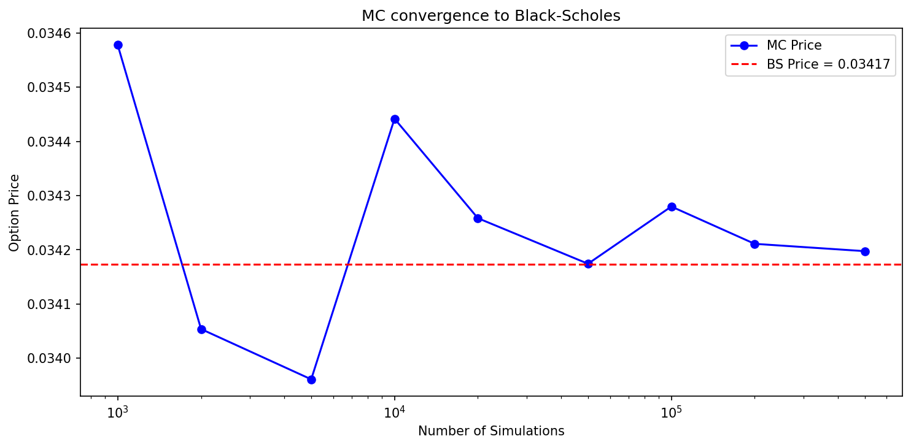
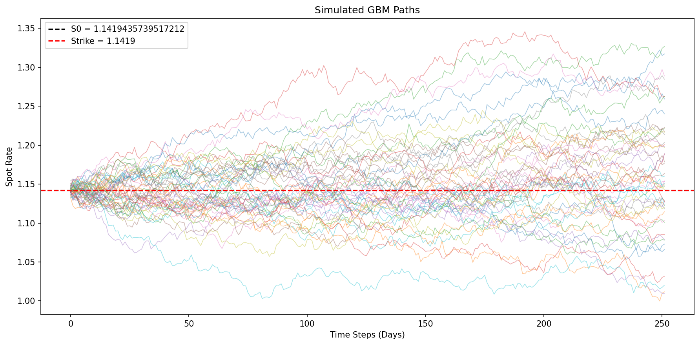
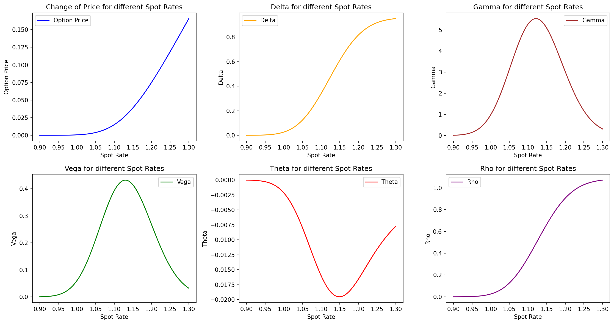
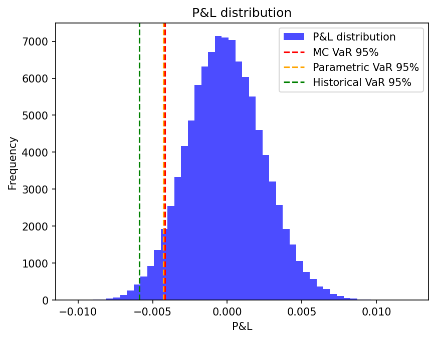
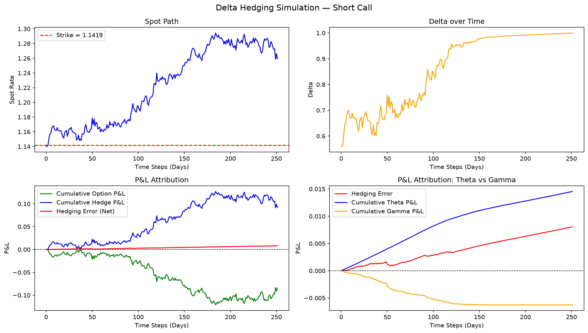
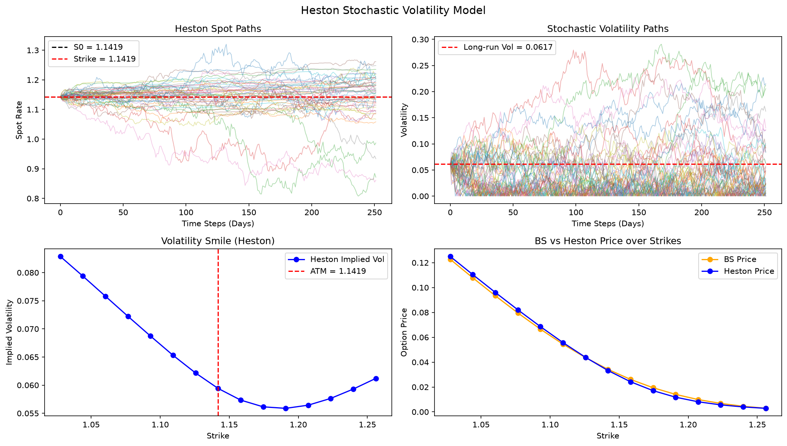
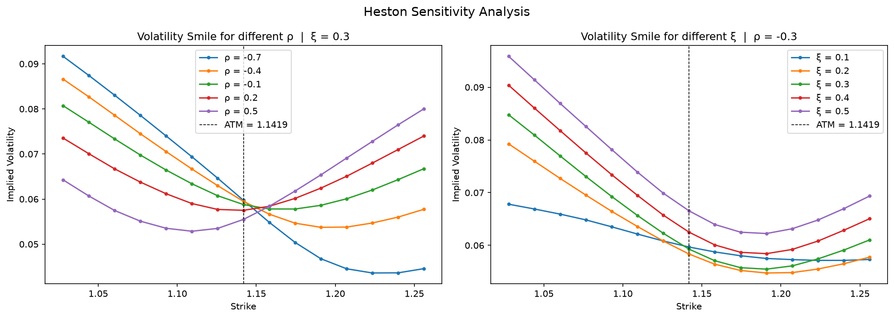

# FX Options Pricing & Risk Engine

A quantitative finance project implementing an FX options pricing and risk management engine in Python. Built to demonstrate derivatives pricing, Greeks, risk modelling, delta hedging, and stochastic volatility — using EUR/USD market data from Yahoo Finance.

---

## Motivation

My career so far has been built in corporate finance — M&A advisory, valuation, and private equity internships. The analytical depth suits me, but markets have always run in parallel.

The turning point was my Bachelor's thesis. Working with a 10.5 million row dataset in R, analysing the predictive power of the Variance Risk Premium on equity returns, I got my first real taste of quantitative research. Starting a Master's in Finance at Católica Lisbon, I wanted to go deeper: not just reading about derivatives pricing, but building it from the ground up.

This project is the result. It starts where every derivatives course starts — Black-Scholes — and systematically breaks its assumptions: constant volatility, continuous hedging, no smile. Each module asks a simple question: what happens when the model meets reality?

I like maths. I like markets. This is what that looks like in code.

## What This Project Covers

**Pricing**
- Garman-Kohlhagen closed-form solution for European FX options
- Monte Carlo pricing via Geometric Brownian Motion with Antithetic Variates
- Convergence analysis: MC pricing converging to BS benchmark as N → ∞




**Greeks**
- Analytical Greeks (Delta, Gamma, Vega, Theta, Rho) via Garman-Kohlhagen
- Numerical Greeks via central finite differences (Monte Carlo)
- Visualisation of all Greeks across a range of spot rates



**Risk**
- Monte Carlo VaR, Parametric VaR, Historical VaR
- P&L distribution over a one-day risk horizon
- Real EUR/USD market data via yfinance



**Delta Hedging**
- Discrete delta hedging simulation for short and long call positions
- P&L attribution: option P&L vs hedge P&L vs hedging error
- Theta/Gamma decomposition of the hedging error



**Stochastic Volatility**
- Euler-Maruyance simulation of spot and variance paths
- Heston vs BS price comparison
- Emergent volatility smile from Heston MC prices via implied vol extraction
- Sensitivity analysis: smile shape as a function of ρ and ξ




**Implied Volatility**
- Brent's root-finding method to invert the BS pricing formula
- Used to extract implied vols from Heston-generated market prices

---

## Project Structure

```
├── main.py                  # Pricing, Greeks, VaR, Convergence
├── run_hedge.py             # Delta Hedging Simulation
├── run_heston.py            # Heston Model & Volatility Smile
├── config.py                # Global seed
│
├── model/
│   └── parameters.py        # FXModelParameters dataclass
├── data/
│   └── market_data.py       # EUR/USD data via yfinance
├── simulation/
│   └── gbm.py               # GBM with Antithetic Variates
├── pricing/
│   ├── black_scholes.py     # Garman-Kohlhagen analytical pricing
│   └── monte_carlo.py       # MC pricing
├── greeks/
│   └── finite_differences.py # Analytical & numerical Greeks
├── risk/
│   └── var.py               # MC, Parametric, Historical VaR
├── volatility/
│   ├── heston.py            # Heston simulation, pricing, smile
│   └── implied_vol.py       # Implied vol via Brent's method
└── hedging/
    └── delta_hedge.py       # Delta hedging & P&L attribution
```

---

## Getting Started

**Install dependencies:**
```bash
pip install -r requirements.txt
```

**Run the pricing engine:**
```bash
python main.py
```

**Run delta hedging simulation:**
```bash
python run_hedge.py
```

**Run Heston model:**
```bash
python run_heston.py
```

---

## Key Results

- MC pricing converges to BS benchmark with error scaling at 1/√N
- Delta hedging error decomposed into Theta gains and Gamma costs
- Heston model generates an emergent volatility smile — absent under BS constant volatility assumption
- Negative spot-vol correlation (ρ) produces volatility skew; symmetric smile emerges as ρ → 0

---

## References

- Garman, M.B. & Kohlhagen, S.W. (1983). *Foreign Currency Option Values.* Journal of International Money and Finance, 2(3), 231–237.
- Black, F. & Scholes, M. (1973). *The Pricing of Options and Corporate Liabilities.* Journal of Political Economy, 81(3), 637–654.
- Heston, S.L. (1993). *A Closed-Form Solution for Options with Stochastic Volatility.* Review of Financial Studies, 6(2), 327–343.
- Glasserman, P. (2003). *Monte Carlo Methods in Financial Engineering.* Springer.
- Hull, J. (2022). *Options, Futures, and Other Derivatives.* Pearson.
- Brent, R.P. (1973). *Algorithms for Minimization without Derivatives.* Prentice-Hall.
- Gatheral, J. (2006). *The Volatility Surface.* Wiley.